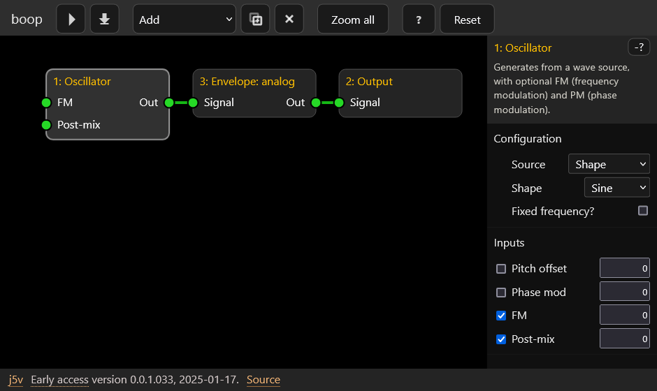

Boop is an offline sample generator that runs in a web browser. It uses the core design of my [https://github.com/j5v/FMC-Amiga](FMC Amiga) synth.

[Boop homepage](https://johnvalentine.co.uk/?art=boop)

Example: This graph generates a sine wave, scales it with an envelope, and sends it to the output.

# Toolchain

This is a web browser app, built in JavaScript with Vite, React, and Zustand.

Find visual components in `/components`, with subfolders `graph` (SVG), `inspector`, `layout`, and `generic`. A design system would be more thorough.

# Maintenance

There are many todos, for functionality and for maintenance.
- Some of the code is written to work in place, and would ideally be refactored and abstracted for DRY or single-purpose blocks.
- Some of the graph interactions are handled by different components, and events delegate functionality depending on the context of the gesture. The overall workflow picture might be a challenge to read, particularly for `SynthGraph` and `SynthNodeInputs`/`SynthNodeOututs`.
- Optimize or memo-ize rerenders. This is only partly done.
- There are currently no tests included here, pending a choice of tools.

# Possible project direction

For details, I maintain a private todo list for this project. I've listed a broad outline of a possible direction below. It's also guided by the original FMC project.

These are the major design and coding directions, at various stages of implementation, numbered for reference rather than order of implementation:

1. It should be fully accessible and localizable, work with a touch screen, work with a screen reader, and be navigable without a mouse. At this stage, the app does not meet these standards throughout.

2. Modularize node types and parameter intents.
    - `src/nodeTypes` is intended to contain a module per node type, each module publishing a function to initialize, process a step, and clean up. The aim is to help contributors code their own node type processor modules, isolating concerns by having a standard interface and a manifest of node types. Dynamic runtime scanning is not a priority.
    - Input intents mean we design an input component once, rather than re-implementing it for every instance. Each input intent lets the user edit a parameter differently, or parse formatted numbers. Additionally, I expect to extend the 'signal' to different types, like parallel streams, or non-PCM data, which will affect node interfaces.

3. It's unlikely that this web browser execution environment will be suitable for real-time synthesis and performance, so I haven't deliberately optimized for performance. For that, I expect a conventional audio plugin (like CLAP, VST, AU) is needed.

4. Performance parameters are emulated, to provide events typical to 'playing' a note. However, this synth is offline, and not a real-time performer. It's not connected to MIDI, and is not wrapped by any plugin architecture. Any performance data is 'designed' in advance to vary the sound.
    - My design includes macros and controllers, which I want to use for a batch generator, to output many files with combinations of performance parameters. For example, to generate velocity layers, note ranges, and round-robin variants for sample-playing software. However, if this becomes a plugin (as a complete rewrite) then the batch generator is less significant, because variants would be synthesized from realtime performance parameters.